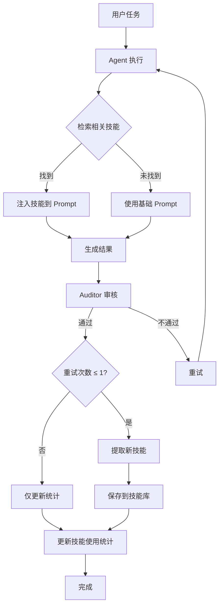

# HyperAgents 技能库系统

## 概述

基于 Meta AI 的 HyperAgents 论文实现的技能库系统，能够自动从成功案例中提取可复用的经验，并在后续任务中智能检索和注入相关技能。

## 核心功能

### 1. 自动技能提取 🧠

当任务审核通过且重试次数 ≤ 1 时，系统会自动提取技能：

```python
# 在 main.py 中自动触发
if final_retries <= 1:
    asyncio.create_task(extract_skill(
        task_id=task_id,
        agent=from_agent,
        instruction=task_info["instruction"],
        result=task_info["result"],
        ai_client=ai,
        notify_fn=...
    ))
```

**提取内容**：
- 任务类型（如"API集成"、"数据分析"）
- 关键步骤（3-5个要点）
- 可复用模板（代码片段或解决方案框架）
- 注意事项和最佳实践

**存储位置**：`skills/{agent}/{skill_id}.json`

### 2. 智能技能检索 🔍

在 agent 执行任务前，自动检索相关技能：

```python
# 在 main.py 中自动执行
relevant_skills = retrieve_relevant_skills(agent_name, instruction, top_k=3)
```

**检索算法**：
- 任务类型匹配（权重：10.0）
- 关键词匹配（权重：2.0）
- 步骤关键词匹配（权重：0.5）
- 使用频率加权（成功率 × 3.0）

### 3. 技能注入 💉

将检索到的技能注入到 agent 的系统提示词中：

```python
if relevant_skills:
    base_prompt = inject_skills_to_prompt(base_prompt, relevant_skills)
```

**注入格式**：
```
原始系统提示词...

============================================================
📚 **相关经验参考**（来自历史成功案例）
============================================================

以下是类似任务的成功经验，供参考：

### 经验 1：Discord Bot 命令处理

**关键步骤**：
- 解析用户输入的命令和参数
- 验证参数有效性
- 调用相应的处理函数
- 格式化输出结果

**参考模板**：
```python
async def handle_command(ctx, *args): ...
```

**注意事项**：注意异常处理和用户友好的错误提示

*（此经验已被使用 5 次，成功率 80%）*
```

### 4. 使用统计跟踪 📊

自动跟踪每个技能的使用情况：

```python
# 任务成功时
update_skill_usage(skill_id, agent, success=True)

# 任务失败时
update_skill_usage(skill_id, agent, success=False)
```

**统计指标**：
- `usage_count`：总使用次数
- `success_count`：成功次数
- `success_rate`：成功率
- `last_used`：最后使用时间

### 5. 低质量技能清理 🧹

定期清理表现不佳的技能：

```python
cleanup_low_quality_skills(min_uses=5, min_success_rate=0.3)
```

**清理条件**：
- 使用次数 ≥ 5 次
- 成功率 < 30%

## 技能数据结构

```json
{
  "id": "a1b2c3d4",
  "task_type": "Discord Bot 命令处理",
  "agent": "developer",
  "steps": [
    "解析用户输入的命令和参数",
    "验证参数有效性",
    "调用相应的处理函数",
    "格式化输出结果"
  ],
  "template": "async def handle_command(ctx, *args): ...",
  "notes": "注意异常处理和用户友好的错误提示",
  "source_task_id": "32d5c694",
  "created_at": "2026-03-29T19:00:00",
  "usage_count": 5,
  "success_count": 4,
  "total_uses": 5,
  "last_used": "2026-03-29T20:00:00"
}
```

## 目录结构

```
skills/
├── captain/
│   ├── a1b2c3d4.json
│   └── e5f6g7h8.json
├── pm/
│   └── i9j0k1l2.json
├── researcher/
│   └── m3n4o5p6.json
├── analyst/
│   └── q7r8s9t0.json
├── developer/
│   ├── u1v2w3x4.json
│   └── y5z6a7b8.json
└── auditor/
    └── c9d0e1f2.json
```

## 工作流程



## 使用示例

### 手动提取技能

```python
from meta_loop import extract_skill

skill_path = await extract_skill(
    task_id="test_001",
    agent="developer",
    instruction="创建一个 Discord Bot 命令",
    result="...",
    ai_client=ai,
    notify_fn=print
)
```

### 手动检索技能

```python
from meta_loop import retrieve_relevant_skills

skills = retrieve_relevant_skills(
    agent="developer",
    instruction="实现一个 API 接口",
    top_k=3
)

for skill in skills:
    print(f"{skill['task_type']}: {skill['id']}")
```

### 手动注入技能

```python
from meta_loop import inject_skills_to_prompt

base_prompt = "你是一个 Developer Agent..."
skills = retrieve_relevant_skills("developer", "创建 API", top_k=2)
enhanced_prompt = inject_skills_to_prompt(base_prompt, skills)
```

### 查看技能统计

```python
import json
import os

agent = "developer"
skills_dir = f"skills/{agent}"

for filename in os.listdir(skills_dir):
    with open(os.path.join(skills_dir, filename), "r") as f:
        skill = json.load(f)
        print(f"{skill['task_type']}: "
              f"{skill['usage_count']} 次使用, "
              f"{skill['success_count']/max(skill['usage_count'], 1):.0%} 成功率")
```

## 测试

运行测试脚本验证功能：

```bash
python test_skills.py
```

测试内容：
1. ✅ 技能提取
2. ✅ 技能检索
3. ✅ 技能注入
4. ✅ 使用统计
5. ✅ 低质量清理

## 配置参数

在 [`meta_loop.py`](../meta_loop.py) 中：

```python
SKILLS_DIR = "D:/a2a-agents/skills"  # 技能库目录
```

在 [`main.py`](../main.py) 中：

```python
# 技能提取条件
if final_retries <= 1:  # 重试次数 ≤ 1 才提取
    extract_skill(...)

# 技能检索数量
relevant_skills = retrieve_relevant_skills(agent, instruction, top_k=3)
```

## 性能优化

### 1. 检索优化

当前使用简单的关键词匹配，未来可以升级为：

```python
# TODO: 使用 embedding 向量相似度
from sentence_transformers import SentenceTransformer

model = SentenceTransformer('all-MiniLM-L6-v2')
instruction_embedding = model.encode(instruction)
skill_embedding = model.encode(skill['task_type'])
similarity = cosine_similarity(instruction_embedding, skill_embedding)
```

### 2. 缓存优化

```python
# 缓存技能数据，避免重复读取文件
_skills_cache = {}

def retrieve_relevant_skills_cached(agent, instruction, top_k=3):
    cache_key = f"{agent}_{hash(instruction)}"
    if cache_key in _skills_cache:
        return _skills_cache[cache_key]
    
    skills = retrieve_relevant_skills(agent, instruction, top_k)
    _skills_cache[cache_key] = skills
    return skills
```

### 3. 异步提取

技能提取已经是异步的，不会阻塞主流程：

```python
asyncio.create_task(extract_skill(...))  # 后台执行
```

## 监控指标

### 技能库健康度

```python
def get_skills_health():
    total_skills = 0
    total_usage = 0
    total_success = 0
    
    for agent_dir in os.listdir(SKILLS_DIR):
        agent_path = os.path.join(SKILLS_DIR, agent_dir)
        if not os.path.isdir(agent_path):
            continue
        
        for filename in os.listdir(agent_path):
            if filename.endswith(".json"):
                with open(os.path.join(agent_path, filename), "r") as f:
                    skill = json.load(f)
                    total_skills += 1
                    total_usage += skill.get("usage_count", 0)
                    total_success += skill.get("success_count", 0)
    
    return {
        "total_skills": total_skills,
        "total_usage": total_usage,
        "avg_success_rate": total_success / max(total_usage, 1),
        "avg_usage_per_skill": total_usage / max(total_skills, 1)
    }
```

### 建议的监控面板

- 📊 技能库大小（按 agent 分类）
- 📈 技能使用趋势（每日/每周）
- ✅ 平均成功率
- 🔥 最常用的技能 Top 10
- 🆕 最近提取的技能
- 🗑️ 待清理的低质量技能

## 最佳实践

### 1. 定期清理

建议每周运行一次清理：

```python
# 在 Discord 中添加管理命令
@bot.command()
@commands.has_role("Admin")
async def cleanup_skills(ctx):
    removed = cleanup_low_quality_skills(min_uses=5, min_success_rate=0.3)
    await ctx.send(f"✅ 清理完成，删除了 {removed} 个低质量技能")
```

### 2. 手动审核新技能

在 Discord 的 `meta-log` 频道查看新提取的技能：

```
📚 **[DEVELOPER]** 提取新技能：Discord Bot 命令处理 (ID: a1b2c3d4)
```

如果发现质量不佳，可以手动删除：

```bash
rm skills/developer/a1b2c3d4.json
```

### 3. 备份技能库

定期备份技能库目录：

```bash
# 每天备份
tar -czf skills_backup_$(date +%Y%m%d).tar.gz skills/
```

### 4. 跨项目共享

技能库可以在多个项目间共享：

```python
# 项目 A
SKILLS_DIR = "/shared/a2a-skills"

# 项目 B
SKILLS_DIR = "/shared/a2a-skills"
```

## 故障排查

### 问题 1：技能未被检索到

**原因**：关键词匹配不准确

**解决**：
1. 检查技能的 `task_type` 是否准确
2. 手动编辑技能文件，添加更多关键词到 `steps` 中
3. 升级到 embedding 向量相似度检索

### 问题 2：技能提取失败

**原因**：AI 返回的 JSON 格式不正确

**解决**：
1. 查看 `meta-log` 频道的错误信息
2. 检查 AI 模型是否支持 JSON 输出
3. 调整 `extract_skill()` 中的 prompt

### 问题 3：技能库过大

**原因**：积累了太多技能

**解决**：
1. 运行 `cleanup_low_quality_skills()`
2. 手动删除过时的技能
3. 设置技能数量上限（如每个 agent 最多 50 个）

## 未来改进

### 短期（1-2周）

- [ ] 添加技能评分机制（基于用户反馈）
- [ ] 实现技能合并（相似技能自动合并）
- [ ] 添加技能标签系统

### 中期（1个月）

- [ ] 升级到 embedding 向量检索
- [ ] 实现技能版本控制
- [ ] 添加技能可视化面板

### 长期（2-3个月）

- [ ] 跨 agent 技能共享
- [ ] 技能市场（导入/导出）
- [ ] 自动技能优化（AI 重写低质量技能）

## 参考资料

- 📄 [HyperAgents 论文](https://ai.meta.com/research/publications/hyperagents/)
- 📂 [详细分析文档](hyperagents_analysis.md)
- 📋 [实施计划](hyperagents_implementation_plan.md)
- 💻 [源代码](../meta_loop.py)

---

**文档版本**：v1.0  
**创建时间**：2026-03-29  
**作者**：Kilo Code
