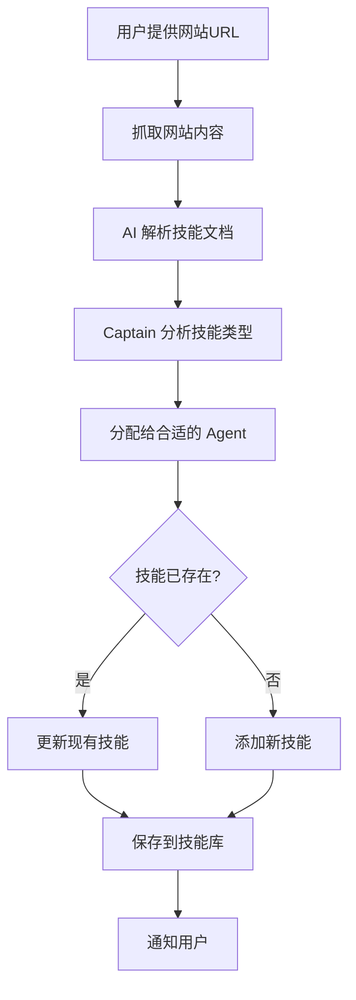

# 从网站学习技能功能使用指南

## 概述

这个功能允许系统从网站自动学习新技能，由 Captain 智能分析并分配给合适的 Agent。

## 使用方法

### 1. 学习技能命令

在 Discord 的 `general-input` 频道中使用：

```
!learn_skills <网站URL>
```

### 2. 查看技能命令

```
!list_skills              # 查看所有 Agent 的技能统计
!list_skills developer    # 查看 Developer 的技能详情
```

## 完整示例

### 示例 1：从技能文档网站学习

```
用户: !learn_skills https://docs.example.com/developer-skills

Bot: 🔍 正在抓取网站内容: https://docs.example.com/developer-skills
Bot: 📄 正在解析技能文档...
Bot: ✅ 已提取 5 个技能文档
Bot: 📋 Captain 正在分析和分配...
Bot: ✅ 分配完成：
  - DEVELOPER: 4 个技能
  - ANALYST: 1 个技能
Bot: 🔄 正在导入技能...
Bot: ✨ [DEVELOPER] 添加新技能: React Hooks 最佳实践 (ID: abc123)
Bot: ✨ [DEVELOPER] 添加新技能: TypeScript 类型系统 (ID: def456)
Bot: 🔄 [DEVELOPER] 更新技能: API 设计模式 (ID: ghi789)
Bot: ✨ [DEVELOPER] 添加新技能: 单元测试策略 (ID: jkl012)
Bot: ✨ [ANALYST] 添加新技能: 数据可视化技巧 (ID: mno345)
Bot: ✅ DEVELOPER: 添加了 3 个新技能，更新了 1 个现有技能
Bot: ✅ ANALYST: 添加了 1 个新技能，更新了 0 个现有技能
Bot: 🎉 技能学习完成！共处理 5 个技能（新增 4，更新 1）
```

### 示例 2：查看技能库

```
用户: !list_skills developer

Bot: 📚 DEVELOPER 的技能库（共 18 个技能）：

1. Discord Bot 命令处理 (ID: test_001)
   使用次数: 15, 成功率: 87%

2. React Hooks 最佳实践 (ID: abc123)
   使用次数: 0, 成功率: N/A

3. API 设计模式 (ID: ghi789)
   使用次数: 8, 成功率: 100%

4. TypeScript 类型系统 (ID: def456)
   使用次数: 0, 成功率: N/A

5. 单元测试策略 (ID: jkl012)
   使用次数: 0, 成功率: N/A

... 还有 13 个技能
```

### 示例 3：查看所有技能统计

```
用户: !list_skills

Bot: 📚 技能库统计：

- CAPTAIN: 2 个技能
- PM: 5 个技能
- RESEARCHER: 8 个技能
- ANALYST: 6 个技能
- DEVELOPER: 18 个技能
- AUDITOR: 3 个技能
```

## 工作流程



## 支持的网站类型

### 1. 静态 HTML 网站
- 技术文档网站
- 博客文章
- 教程网站

### 2. Markdown 文档
- GitHub README
- GitBook 文档
- 在线文档

### 3. 结构化内容
- 包含标题、列表、代码块的页面
- 有清晰章节划分的文档

## 技能提取规则

AI 会从网站内容中提取：

1. **技能标题**：从页面标题或章节标题提取
2. **技能描述**：从摘要或简介提取
3. **关键步骤**：从编号列表或步骤说明提取
4. **代码模板**：从代码块提取
5. **注意事项**：从提示、警告或最佳实践部分提取

## Captain 分配逻辑

Captain 会根据技能内容自动分配给合适的 Agent：

| 技能类型 | 分配给 |
|---------|--------|
| 编程、API、数据库、框架 | Developer |
| 信息收集、调研、文献分析 | Researcher |
| 数据分析、洞察、报告 | Analyst |
| 计划、协调、时间管理 | PM |
| 代码审查、质量保证 | Auditor |
| 任务分解、团队协作 | Captain |

## 技能更新策略

### 新增技能
- 技能标题不存在时，创建新技能
- 分配唯一的 ID
- 初始使用次数为 0

### 更新技能
- 技能标题已存在时，更新内容
- 在 `notes` 字段追加新内容
- 保留原有的使用统计

## 安全考虑

### 1. URL 验证
- 只允许 http:// 和 https:// 协议
- 拒绝本地文件路径（file://）

### 2. 内容大小限制
- 抓取的内容限制在 8000 字符以内
- 超出部分会被截断

### 3. 超时控制
- 网站抓取超时时间：30 秒
- AI 解析超时：由 AI 客户端控制

### 4. 错误处理
- 网站无法访问：返回错误信息
- 解析失败：返回空结果
- AI 调用失败：捕获异常并通知用户

## 最佳实践

### 1. 选择合适的网站
✅ **推荐**：
- 官方技术文档
- 知名博客的教程文章
- GitHub 项目的 README
- 结构化的学习资源

❌ **不推荐**：
- 动态加载的网站（JavaScript 渲染）
- 需要登录的网站
- 内容混乱的网站
- 广告过多的网站

### 2. 验证学习结果
学习完成后，建议：
1. 使用 `!list_skills <agent>` 查看新增的技能
2. 检查技能的 `task_type` 是否准确
3. 查看 `skills/{agent}/{skill_id}.json` 文件内容
4. 如果质量不佳，手动删除或编辑

### 3. 定期清理
```python
# 在 Python 中运行
from meta_loop import cleanup_low_quality_skills
removed = cleanup_low_quality_skills(min_uses=5, min_success_rate=0.3)
print(f"清理了 {removed} 个低质量技能")
```

## 故障排查

### 问题 1：网站抓取失败

**错误信息**：`❌ 网站抓取失败: ...`

**可能原因**：
- 网站无法访问
- 网络连接问题
- 网站需要登录

**解决方法**：
1. 检查 URL 是否正确
2. 尝试在浏览器中打开 URL
3. 检查网络连接
4. 使用其他网站测试

### 问题 2：未找到技能文档

**错误信息**：`⚠️ 未找到技能文档`

**可能原因**：
- 网站内容不包含技能相关信息
- AI 无法识别技能模式

**解决方法**：
1. 确保网站包含清晰的技能描述
2. 选择结构化的文档网站
3. 尝试更具体的技能文档页面

### 问题 3：技能分配不准确

**现象**：技能被分配给错误的 Agent

**解决方法**：
1. 手动移动技能文件到正确的 Agent 目录
2. 编辑技能文件的 `agent` 字段
3. 提供反馈以改进 Captain 的分配逻辑

## 技术细节

### 网站内容抓取

使用 `httpx` + `BeautifulSoup` 抓取和解析 HTML：

```python
async with httpx.AsyncClient(timeout=30) as client:
    response = await client.get(url)
    soup = BeautifulSoup(response.text, 'html.parser')
    text = soup.get_text()
```

### AI 解析

使用 LLM 分析网站内容并提取技能：

```python
prompt = f"""分析以下网站内容，提取所有技能相关的文档。

网站内容：
{content}

请提取：
1. 每个技能的标题
2. 技能描述
3. 技能详细内容
4. 技能类别

输出 JSON 格式...
"""
```

### Captain 分配

Captain 根据技能内容决定分配给哪个 Agent：

```python
prompt = f"""你是 Captain，负责将技能分配给合适的 Agent。

可用的 Agent：
- developer: 开发相关技能
- researcher: 研究相关技能
- analyst: 分析相关技能
...

待分配的技能：
{skills_summary}

请为每个技能分配最合适的 Agent...
"""
```

## 未来改进

### 短期
- [ ] 支持 JavaScript 渲染的网站（使用 Puppeteer）
- [ ] 添加技能预览功能（学习前预览将要添加的技能）
- [ ] 支持批量学习（一次性从多个 URL 学习）

### 中期
- [ ] 技能质量评分（AI 评估技能质量）
- [ ] 技能去重（自动合并相似技能）
- [ ] 技能版本控制（跟踪技能的更新历史）

### 长期
- [ ] 技能市场（分享和导入其他用户的技能）
- [ ] 自动更新（定期检查网站更新）
- [ ] 多语言支持（学习英文、日文等文档）

## 相关文档

- 📄 [HyperAgents 详细分析](../plans/hyperagents_analysis.md)
- 📋 [实施计划](../plans/hyperagents_implementation_plan.md)
- 📚 [技能库系统使用指南](HYPERAGENTS_SKILLS.md)
- 🔧 [功能设计文档](../plans/skill_learning_from_web.md)

## 源代码

- [`skill_web_learning.py`](../skill_web_learning.py) - 网站学习功能实现
- [`meta_loop.py`](../meta_loop.py) - 技能库核心功能
- [`main.py`](../main.py) - Discord 命令集成

---

**文档版本**：v1.0  
**创建时间**：2026-03-29  
**作者**：Kilo Code
