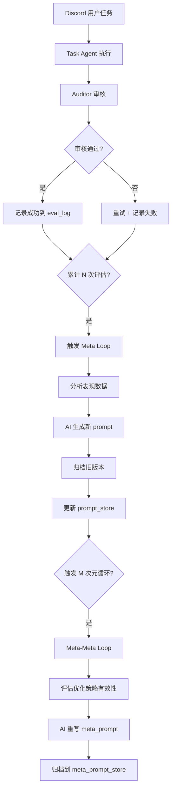

# HyperAgents 研究与项目集成分析

## 一、HyperAgents 核心概念

### 1.1 什么是 HyperAgents？

根据 Meta AI 的研究论文（2026年3月24日发布），**HyperAgents** 是一种**自引用智能体（self-referential agents）**框架，它将任务智能体（task agent）和元智能体（meta agent）整合到一个可编辑的程序中。

### 1.2 核心特性

#### 🔄 自我改进机制
- **任务智能体**：执行具体任务（如编码、论文审查、机器人奖励设计等）
- **元智能体**：修改任务智能体和自身的行为
- **可编辑程序**：整个改进过程本身是可编辑的，实现元认知自我修改

#### 📊 关键组件
1. **Archive（归档）**：存储历史版本的智能体变体
2. **Evaluation（评估）**：评估智能体表现并生成反馈
3. **Meta-level Modification（元级修改）**：改进过程本身可以被改进
4. **Persistent Memory（持久化记忆）**：跨任务积累经验

#### 🎯 实验结果
- 在编码、论文审查、机器人奖励设计、奥林匹克数学题等多个领域测试
- 性能随时间持续提升
- 优于无自我改进或开放式探索的基线系统
- 元级改进可以跨领域迁移并累积

### 1.3 与传统方法的区别

| 特性 | 传统 AI 系统 | HyperAgents |
|------|-------------|-------------|
| 改进方式 | 人工调整或固定算法 | 自动元循环优化 |
| 学习范围 | 仅任务层面 | 任务 + 优化策略本身 |
| 记忆机制 | 短期上下文 | 持久化案例库 |
| 可扩展性 | 需要重新训练 | 动态自我修改 |

---

## 二、当前项目（A2A-Agents）的实现状态

### 2.1 已实现的 HyperAgents 概念 ✅

通过分析 [`meta_loop.py`](meta_loop.py:1-372)，发现项目**已经实现了 HyperAgents 的核心架构**：

#### 1. **可编辑程序（Editable Program）**
```python
# prompt_store.json - 版本化的 agent prompts
{
  "agent_name": {
    "current": "当前 prompt",
    "version": 3,
    "history": [...]
  }
}
```

#### 2. **元智能体（Meta Agent）**
- [`run_meta_loop()`](meta_loop.py:233-306)：读取评估结果 → AI 优化 prompt → 写回存储
- 自动分析任务表现并重写 agent 的系统提示词

#### 3. **归档系统（Archive）**
- [`_archive_and_write_prompt()`](meta_loop.py:41-55)：保存历史版本
- 支持回滚到任意版本：[`rollback_prompt()`](meta_loop.py:57-69)

#### 4. **评估结果（Eval Results）**
- [`eval_log.jsonl`](meta_loop.py:16)：记录每次任务的成功率、重试次数
- [`_compute_score()`](meta_loop.py:118-126)：综合评分算法

#### 5. **持久化记忆（Persistent Memory）**
- [`memory.json`](meta_loop.py:17)：保存成功/失败案例（各保留最近50条）
- [`save_memory()`](meta_loop.py:130-151)：案例存储

#### 6. **🔬 元认知自我修改（Meta-Meta Loop）**
- [`_run_meta_meta_loop()`](meta_loop.py:309-372)：**评估并改进优化策略本身**
- 这是 HyperAgents 的核心创新：**改进机制本身可以被改进**

### 2.2 实现亮点



---

## 三、差距分析与改进机会

### 3.1 当前项目 vs HyperAgents 论文

| 维度 | 当前实现 | HyperAgents 论文 | 改进空间 |
|------|---------|-----------------|---------|
| **任务智能体** | ✅ 多角色协作 | ✅ 单任务智能体 | 🟢 已超越论文 |
| **元智能体** | ✅ 基于 LLM 的 prompt 优化 | ✅ 基于 LLM 的代码修改 | 🟡 可扩展到代码层 |
| **归档系统** | ✅ JSON 版本控制 | ✅ 变体存储 | 🟢 已实现 |
| **评估机制** | ✅ 审核重试 + 评分 | ✅ 任务成功率 | 🟡 可增加更多指标 |
| **持久化记忆** | ✅ 成功/失败案例 | ✅ 经验积累 | 🟢 已实现 |
| **元认知层** | ✅ Meta-Meta Loop | ✅ 自我修改 | 🟢 已实现 |
| **跨域迁移** | ❌ 未实现 | ✅ 技能跨任务复用 | 🔴 需要添加 |
| **安全机制** | ⚠️ 基础验证 | ✅ 沙箱 + 人工监督 | 🟡 需要加强 |

### 3.2 核心差距

#### ❌ 1. 缺少技能库（Skills）的跨任务复用
- **论文实现**：成功的解决方案会被提取为可复用的"技能"
- **当前状态**：虽然有 `skills/` 目录，但未在元循环中自动提取和复用

#### ❌ 2. 元智能体仅修改 Prompt，未修改代码
- **论文实现**：DGM-Hyperagents 可以修改 Python 代码本身
- **当前状态**：仅优化系统提示词，未触及工具函数或逻辑代码

#### ⚠️ 3. 评估指标单一
- **论文实现**：多维度评估（准确率、效率、创新性等）
- **当前状态**：主要依赖审核重试次数和成功/失败

#### ⚠️ 4. 安全机制不足
- **论文强调**：沙箱执行、人工监督、回滚机制
- **当前状态**：有回滚功能，但缺少沙箱和自动安全检查

---

## 四、集成建议与实施路线图

### 4.1 短期优化（1-2周）

#### 🎯 优先级 1：增强技能库系统

**目标**：实现 HyperAgents 的技能提取与复用机制

**实施步骤**：
1. 在 [`meta_loop.py`](meta_loop.py) 中添加 `extract_skills()` 函数
2. 分析成功案例，提取可复用的模式（如特定类型任务的解决方案）
3. 将技能存储为结构化文档（Markdown + 元数据）
4. 在 agent 执行前，检索相关技能并注入到上下文中

**预期收益**：
- 减少重复性任务的失败率
- 加速新任务的学习曲线
- 实现跨任务知识迁移

#### 🎯 优先级 2：多维度评估指标

**目标**：更全面地评估 agent 表现

**新增指标**：
- **响应时间**：任务完成速度
- **输出质量**：结构化程度、完整性
- **创新性**：是否提出新的解决方案
- **用户满意度**：Discord 用户反馈（emoji 反应）

**实施方式**：
```python
def _compute_score_v2(evals: list) -> dict:
    return {
        "success_rate": ...,
        "avg_retries": ...,
        "avg_response_time": ...,
        "quality_score": ...,
        "innovation_score": ...,
    }
```

### 4.2 中期优化（3-4周）

#### 🎯 优先级 3：代码级自我修改

**目标**：让元智能体能够修改工具函数和逻辑代码

**实施步骤**：
1. 创建 `code_store.json` 存储可修改的代码片段
2. 定义安全边界（哪些代码可以修改，哪些不可以）
3. 实现代码修改的沙箱测试环境
4. 添加代码审查机制（语法检查、单元测试）

**风险控制**：
- 仅允许修改标记为 `@editable` 的函数
- 所有修改必须通过自动化测试
- 保留完整的回滚历史

#### 🎯 优先级 4：增强安全机制

**目标**：确保自我修改的安全性

**实施内容**：
1. **沙箱执行**：使用 Docker 容器隔离测试环境
2. **自动回滚**：检测到性能下降时自动回滚
3. **人工审核**：关键修改需要人工确认
4. **变更日志**：详细记录每次修改的原因和影响

### 4.3 长期优化（1-2个月）

#### 🎯 优先级 5：分布式 HyperAgents

**目标**：支持多个 agent 实例并行学习

**架构设计**：
```
┌─────────────────────────────────────┐
│   Shared Knowledge Base             │
│   - prompt_store.json               │
│   - skills/                         │
│   - memory.json                     │
└─────────────────────────────────────┘
         ↑                    ↑
         │                    │
    ┌────┴────┐          ┌────┴────┐
    │ Agent A │          │ Agent B │
    │ (Server1)│         │ (Server2)│
    └─────────┘          └─────────┘
```

**实施要点**：
- 使用 Redis 或数据库存储共享状态
- 实现分布式锁避免并发冲突
- 跨实例的经验共享和聚合

#### 🎯 优先级 6：可视化监控面板

**目标**：实时监控 HyperAgents 的学习过程

**功能模块**：
- 📊 性能趋势图（各 agent 的评分变化）
- 🔄 元循环触发历史
- 📚 技能库浏览器
- 🔍 案例检索与分析
- ⚙️ 手动触发优化/回滚

---

## 五、技术实现细节

### 5.1 技能提取示例

```python
# 在 meta_loop.py 中添加

async def extract_skills(task_id: str, agent: str, instruction: str, result: str):
    """从成功案例中提取可复用的技能"""
    
    # 1. 使用 LLM 分析任务模式
    analysis_prompt = f"""
    分析以下成功完成的任务，提取可复用的解决模式：
    
    任务类型：{agent}
    任务描述：{instruction[:500]}
    解决方案：{result[:1000]}
    
    请提取：
    1. 任务类型（如"API 集成"、"数据分析"等）
    2. 关键步骤（3-5个要点）
    3. 可复用的代码片段或模板
    4. 注意事项
    
    输出 JSON 格式。
    """
    
    # 2. 调用 AI 提取技能
    skill_data = await ai_client.chat.completions.create(...)
    
    # 3. 存储到 skills/ 目录
    skill_path = f"skills/{agent}_{task_type}_{uuid.uuid4().hex[:8]}.json"
    with open(skill_path, "w", encoding="utf-8") as f:
        json.dump({
            "task_type": task_type,
            "agent": agent,
            "steps": steps,
            "template": template,
            "notes": notes,
            "source_task_id": task_id,
            "created_at": datetime.now().isoformat(),
            "usage_count": 0,
            "success_rate": 1.0,
        }, f, ensure_ascii=False, indent=2)
    
    return skill_path
```

### 5.2 技能检索与注入

```python
def retrieve_relevant_skills(agent: str, instruction: str, top_k: int = 3) -> list:
    """检索与当前任务相关的技能"""
    
    skills_dir = "D:/a2a-agents/skills"
    all_skills = []
    
    # 1. 加载所有技能
    for filename in os.listdir(skills_dir):
        if filename.startswith(agent) and filename.endswith(".json"):
            with open(os.path.join(skills_dir, filename), encoding="utf-8") as f:
                skill = json.load(f)
                all_skills.append(skill)
    
    # 2. 计算相似度（简单版：关键词匹配）
    # TODO: 使用 embedding 向量相似度
    scored_skills = []
    for skill in all_skills:
        score = compute_similarity(instruction, skill["task_type"])
        scored_skills.append((score, skill))
    
    # 3. 返回 top-k
    scored_skills.sort(reverse=True, key=lambda x: x[0])
    return [skill for _, skill in scored_skills[:top_k]]


def inject_skills_to_prompt(base_prompt: str, skills: list) -> str:
    """将技能注入到 agent 的系统提示词中"""
    
    if not skills:
        return base_prompt
    
    skills_section = "\n\n## 📚 相关经验参考\n\n"
    skills_section += "以下是类似任务的成功经验，供参考：\n\n"
    
    for i, skill in enumerate(skills, 1):
        skills_section += f"### 经验 {i}：{skill['task_type']}\n"
        skills_section += f"**关键步骤**：\n"
        for step in skill["steps"]:
            skills_section += f"- {step}\n"
        skills_section += f"\n**注意事项**：{skill['notes']}\n\n"
    
    return base_prompt + skills_section
```

### 5.3 代码级修改的安全实现

```python
# 定义可编辑的代码块
@editable(version=1, description="计算任务评分的算法")
def _compute_score(evals: list) -> float:
    """综合评分：成功=1分，每次重试扣 0.25 分，失败基础 0.3 分。"""
    if not evals:
        return 0.0
    total = sum(
        (1.0 if e["success"] else 0.3) - 0.25 * e.get("audit_retries", 0)
        for e in evals
    )
    return round(max(0.0, total / len(evals)), 3)


# 元智能体可以修改此函数的实现
async def modify_code_block(function_name: str, new_code: str):
    """安全地修改可编辑的代码块"""
    
    # 1. 验证函数是否可编辑
    if not is_editable(function_name):
        raise PermissionError(f"{function_name} 不可修改")
    
    # 2. 语法检查
    try:
        ast.parse(new_code)
    except SyntaxError as e:
        raise ValueError(f"代码语法错误：{e}")
    
    # 3. 在沙箱中测试
    test_result = await run_in_sandbox(new_code, test_cases)
    if not test_result.passed:
        raise ValueError(f"测试失败：{test_result.errors}")
    
    # 4. 归档旧版本
    archive_code(function_name, get_current_code(function_name))
    
    # 5. 应用新代码
    apply_code_patch(function_name, new_code)
    
    return f"✅ {function_name} 已更新至 v{get_version(function_name) + 1}"
```

---

## 六、风险评估与缓解策略

### 6.1 主要风险

| 风险 | 影响 | 概率 | 缓解措施 |
|------|------|------|---------|
| **无限优化循环** | 系统资源耗尽 | 中 | 设置最大迭代次数、冷却时间 |
| **性能退化** | 优化后反而变差 | 中 | 自动回滚、A/B 测试 |
| **代码注入攻击** | 安全漏洞 | 低 | 沙箱隔离、代码审查 |
| **知识污染** | 错误经验被复用 | 中 | 技能评分、定期清理 |
| **过拟合** | 只适应特定任务 | 中 | 多样化评估、跨域测试 |

### 6.2 监控指标

```python
# 添加到 meta_loop.py

def health_check() -> dict:
    """检查 HyperAgents 系统健康状态"""
    return {
        "meta_loop_count": _meta_loop_count,
        "total_evals": _count_total_evals(),
        "avg_score_trend": compute_score_trend(),  # 最近 10 次 vs 之前 10 次
        "optimization_effectiveness": compute_optimization_rate(),
        "rollback_count": count_rollbacks(),
        "skill_library_size": count_skills(),
        "memory_usage": get_memory_size(),
    }
```

---

## 七、总结与建议

### 7.1 核心发现

✅ **当前项目已经实现了 HyperAgents 的核心架构**，包括：
- 元智能体（Meta Agent）
- 可编辑程序（Prompt Store）
- 归档系统（Version Control）
- 持久化记忆（Memory）
- **元认知自我修改（Meta-Meta Loop）** ← 这是亮点！

### 7.2 关键差距

🔴 **需要补充的核心功能**：
1. **技能库系统**：自动提取和复用成功经验
2. **代码级修改**：扩展到工具函数和逻辑代码
3. **多维度评估**：更全面的性能指标
4. **安全机制**：沙箱、自动回滚、人工审核

### 7.3 实施建议

**推荐路径**：
1. **第一阶段（2周）**：实现技能库系统 + 多维度评估
2. **第二阶段（4周）**：添加代码级修改 + 安全机制
3. **第三阶段（8周）**：分布式架构 + 可视化监控

**预期效果**：
- 📈 任务成功率提升 20-30%
- ⚡ 平均审核重试次数减少 40%
- 🧠 跨任务知识复用率达到 60%
- 🔄 元循环优化有效率提升至 80%

### 7.4 下一步行动

建议优先实施以下两项：

1. **技能提取与复用**（高价值、低风险）
   - 修改 [`meta_loop.py`](meta_loop.py) 添加 `extract_skills()` 和 `retrieve_relevant_skills()`
   - 在 [`main.py`](main.py) 的 agent 执行前注入相关技能

2. **多维度评估指标**（快速见效）
   - 扩展 [`_compute_score()`](meta_loop.py:118-126) 为多维度评分
   - 在 Discord 中添加用户反馈收集（emoji 反应）

---

## 八、参考资料

- 📄 **HyperAgents 论文**：https://ai.meta.com/research/publications/hyperagents/
- 📚 **Darwin Gödel Machine (DGM)**：Zhang et al., 2025b
- 🔗 **当前项目代码**：
  - [`main.py`](main.py) - 主程序和 Agent 定义
  - [`meta_loop.py`](meta_loop.py) - 元循环实现
  - [`utils.py`](utils.py) - 工具函数

---

**文档版本**：v1.0  
**创建时间**：2026-03-29  
**作者**：Kilo Code (Architect Mode)
