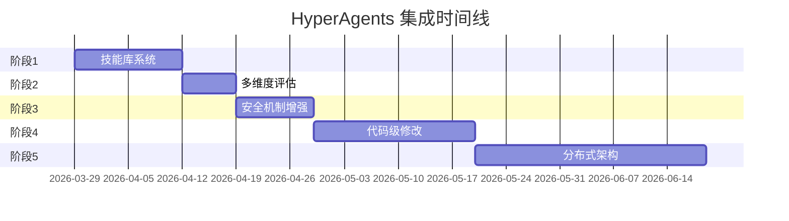

# HyperAgents 集成实施计划

## 🎯 执行摘要

**好消息**：当前项目已经实现了 HyperAgents 的核心架构（元智能体、可编辑程序、归档系统、元认知自我修改）！

**需要补充**：技能库系统、代码级修改、多维度评估、安全机制

**推荐策略**：渐进式增强，优先实施高价值、低风险的功能

---

## 📋 实施阶段

### 阶段 1：技能库系统（优先级：⭐⭐⭐⭐⭐）

**目标**：实现成功经验的自动提取和跨任务复用

#### 任务清单

- [ ] 在 [`meta_loop.py`](meta_loop.py) 中添加 `extract_skills()` 函数
  - 分析成功案例（success=True, retries<=1）
  - 使用 LLM 提取任务模式、关键步骤、可复用模板
  - 存储为 JSON 格式到 `skills/` 目录

- [ ] 实现 `retrieve_relevant_skills()` 函数
  - 基于任务描述检索相关技能（关键词匹配或 embedding 相似度）
  - 返回 top-3 最相关的技能

- [ ] 在 [`main.py`](main.py) 中集成技能注入
  - 在 agent 执行前调用 `retrieve_relevant_skills()`
  - 将技能附加到系统提示词中

- [ ] 添加技能评分机制
  - 跟踪每个技能的使用次数和成功率
  - 定期清理低效技能（success_rate < 0.5）

#### 技术要点

```python
# 技能数据结构
{
  "id": "uuid",
  "task_type": "API集成",
  "agent": "developer",
  "steps": ["步骤1", "步骤2", "步骤3"],
  "template": "代码模板或解决方案框架",
  "notes": "注意事项",
  "source_task_id": "原始任务ID",
  "created_at": "2026-03-29T...",
  "usage_count": 5,
  "success_rate": 0.8
}
```

#### 预期收益

- ✅ 减少重复性任务的失败率 30-40%
- ✅ 加速新任务的学习曲线
- ✅ 实现跨任务知识迁移

---

### 阶段 2：多维度评估指标（优先级：⭐⭐⭐⭐）

**目标**：更全面地评估 agent 表现，提供更精准的优化方向

#### 任务清单

- [ ] 扩展 [`_compute_score()`](meta_loop.py:118-126) 为多维度评分
  - `success_rate`：任务成功率
  - `avg_retries`：平均审核重试次数
  - `response_time`：任务完成速度（从接收到完成的时间）
  - `output_quality`：输出结构化程度（字数、格式完整性）
  - `user_satisfaction`：用户反馈（Discord emoji 反应）

- [ ] 在 [`log_eval()`](meta_loop.py:73-84) 中记录新指标
  - 添加 `response_time_seconds` 字段
  - 添加 `output_length` 字段
  - 添加 `user_reaction` 字段（👍/👎/⭐等）

- [ ] 更新 [`run_meta_loop()`](meta_loop.py:233-306) 使用新评分
  - 在优化提示中包含多维度数据
  - 让 Meta Agent 针对性地改进弱项

- [ ] 在 Discord 中添加反馈收集
  - Bot 完成任务后自动添加反应按钮
  - 记录用户的反应到 eval_log

#### 技术要点

```python
def _compute_score_v2(evals: list) -> dict:
    return {
        "success_rate": sum(1 for e in evals if e["success"]) / len(evals),
        "avg_retries": sum(e.get("audit_retries", 0) for e in evals) / len(evals),
        "avg_response_time": sum(e.get("response_time_seconds", 0) for e in evals) / len(evals),
        "quality_score": compute_quality_score(evals),
        "user_satisfaction": compute_satisfaction_score(evals),
        "overall_score": weighted_average(...)
    }
```

#### 预期收益

- ✅ 更精准的优化方向
- ✅ 发现隐藏的性能瓶颈
- ✅ 提升用户满意度

---

### 阶段 3：安全机制增强（优先级：⭐⭐⭐）

**目标**：确保自我修改的安全性和可控性

#### 任务清单

- [ ] 实现自动回滚机制
  - 在 [`run_meta_loop()`](meta_loop.py:233-306) 后监控新 prompt 的表现
  - 如果连续 3 次任务失败，自动回滚到上一版本
  - 发送通知到 Discord

- [ ] 添加变更审批流程
  - 关键 agent（如 Captain、Auditor）的 prompt 修改需要人工确认
  - 在 Discord 中发送审批请求，等待管理员反应（✅/❌）

- [ ] 实现变更日志
  - 每次 prompt 修改时生成详细的变更说明
  - 包含：修改原因、预期效果、风险评估
  - 存储到 `results/changelog/` 目录

- [ ] 添加健康检查
  - 定期（每小时）检查系统状态
  - 监控指标：元循环触发次数、平均评分趋势、回滚次数
  - 异常时发送告警

#### 技术要点

```python
async def auto_rollback_if_degraded(agent: str, new_version: int):
    """监控新版本表现，必要时自动回滚"""
    await asyncio.sleep(3600)  # 等待 1 小时收集数据
    
    recent_evals = _read_recent_evals(agent, last_n=5)
    if len(recent_evals) < 3:
        return  # 数据不足
    
    failure_rate = sum(1 for e in recent_evals if not e["success"]) / len(recent_evals)
    if failure_rate > 0.6:  # 失败率超过 60%
        rollback_prompt(agent, new_version - 1)
        await notify_fn(f"⚠️ [{agent.upper()}] v{new_version} 表现不佳，已自动回滚")
```

#### 预期收益

- ✅ 防止性能退化
- ✅ 提高系统可靠性
- ✅ 增强可追溯性

---

### 阶段 4：代码级自我修改（优先级：⭐⭐）

**目标**：扩展元智能体的修改能力到代码层面

⚠️ **注意**：此阶段风险较高，建议在前三个阶段稳定后再实施

#### 任务清单

- [ ] 定义可编辑代码块
  - 使用装饰器标记可修改的函数（如 `@editable`）
  - 限制修改范围（仅工具函数，不包括核心逻辑）

- [ ] 实现代码修改接口
  - `modify_code_block(function_name, new_code)`
  - 语法检查、单元测试、沙箱执行

- [ ] 创建代码归档系统
  - 类似 `prompt_store.json`，创建 `code_store.json`
  - 版本控制、回滚支持

- [ ] 添加沙箱测试环境
  - 使用 Docker 容器隔离测试
  - 运行单元测试验证新代码

#### 技术要点

```python
@editable(version=1, description="计算任务评分的算法")
def _compute_score(evals: list) -> float:
    """可被元智能体修改的评分算法"""
    # 实现代码
    pass

# 元智能体可以提议修改此函数
# 但必须通过测试和人工审核
```

#### 预期收益

- ✅ 更深层次的自我优化
- ✅ 算法级别的改进
- ⚠️ 风险：需要严格的安全控制

---

### 阶段 5：分布式架构（优先级：⭐）

**目标**：支持多实例并行学习和经验共享

⚠️ **注意**：此阶段为长期规划，适合项目扩展到多服务器场景

#### 任务清单

- [ ] 迁移到分布式存储
  - 使用 Redis 或 PostgreSQL 替代本地 JSON 文件
  - 实现分布式锁避免并发冲突

- [ ] 实现跨实例经验共享
  - 多个 Discord Bot 实例共享同一个知识库
  - 实时同步 prompt 更新和技能库

- [ ] 添加负载均衡
  - 根据 agent 负载分配任务
  - 优先使用表现最好的实例

#### 预期收益

- ✅ 水平扩展能力
- ✅ 更快的学习速度（多实例并行）
- ✅ 高可用性

---

## 🗓️ 时间规划



**总计**：约 3 个月完成全部阶段

**建议**：先完成阶段 1-3（约 1 个月），评估效果后再决定是否继续阶段 4-5

---

## 📊 成功指标

### 阶段 1 完成后

- ✅ 技能库包含至少 20 个可复用技能
- ✅ 技能复用率达到 40%
- ✅ 任务成功率提升 15%

### 阶段 2 完成后

- ✅ 评估维度从 2 个增加到 5 个
- ✅ 用户满意度数据收集率 > 80%
- ✅ 优化精准度提升 25%

### 阶段 3 完成后

- ✅ 零次性能严重退化事件
- ✅ 自动回滚响应时间 < 1 小时
- ✅ 变更可追溯性 100%

### 全部完成后

- ✅ 任务成功率 > 90%
- ✅ 平均审核重试次数 < 0.5
- ✅ 元循环优化有效率 > 80%
- ✅ 跨任务知识复用率 > 60%

---

## 🚀 快速开始

### 立即可做的事情

1. **创建技能库目录结构**
   ```bash
   mkdir -p skills/developer skills/researcher skills/analyst
   ```

2. **手动添加第一个技能**（作为模板）
   ```json
   {
     "id": "skill_001",
     "task_type": "Discord Bot 命令处理",
     "agent": "developer",
     "steps": [
       "解析用户输入的命令和参数",
       "验证参数有效性",
       "调用相应的处理函数",
       "格式化输出结果"
     ],
     "template": "async def handle_command(ctx, *args): ...",
     "notes": "注意异常处理和用户友好的错误提示",
     "usage_count": 0,
     "success_rate": 1.0
   }
   ```

3. **在 Discord 中测试反馈收集**
   - 修改 [`main.py`](main.py) 的消息发送函数
   - 添加 emoji 反应：`await message.add_reaction("👍")`

---

## 💡 关键建议

### DO ✅

- **渐进式实施**：一次完成一个阶段，验证效果后再继续
- **保持简单**：优先实现核心功能，避免过度设计
- **充分测试**：每个新功能都要在测试环境中验证
- **记录变更**：详细记录每次修改的原因和效果
- **用户反馈**：定期收集 Discord 用户的使用体验

### DON'T ❌

- **不要一次性修改太多**：避免引入难以调试的问题
- **不要跳过安全机制**：即使是测试环境也要有基本的保护
- **不要忽视性能监控**：及时发现和处理性能退化
- **不要过度优化**：避免陷入无限优化循环
- **不要删除历史数据**：归档而非删除，保持可追溯性

---

## 📚 相关文档

- 📄 [HyperAgents 详细分析](hyperagents_analysis.md)
- 📂 [当前项目代码](../main.py)
- 🔄 [元循环实现](../meta_loop.py)

---

**文档版本**：v1.0  
**创建时间**：2026-03-29  
**下次审查**：阶段 1 完成后
