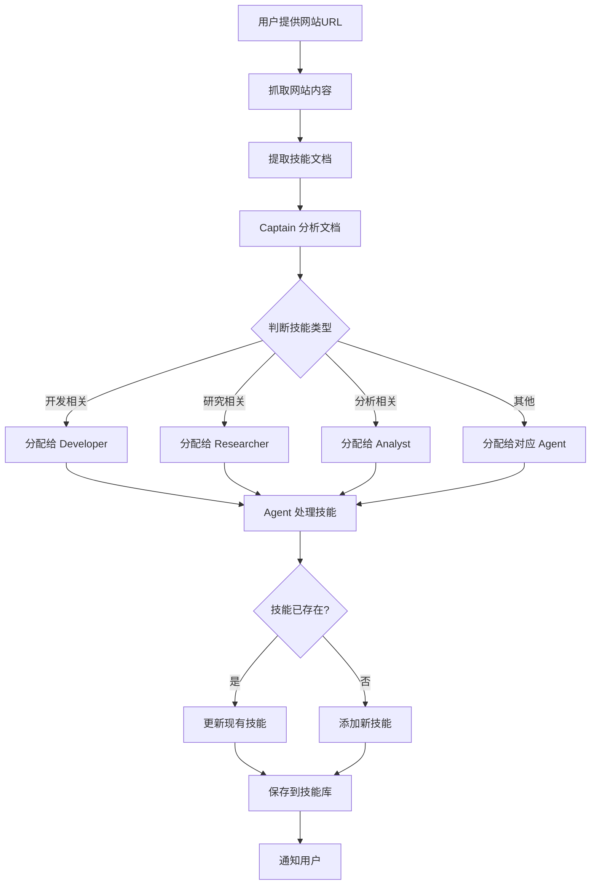

# 从网站文档学习技能功能设计

## 需求描述

用户提供一个包含技能文档的网站URL，系统自动：
1. 抓取网站内容
2. 解析技能相关文档
3. 由 Captain 分析并分配给合适的 Agent
4. 更新或添加新技能到技能库

## 功能设计

### 1. 工作流程



### 2. 核心组件

#### 2.1 网站内容抓取器

```python
async def fetch_website_content(url: str) -> str:
    """
    抓取网站内容
    
    Args:
        url: 网站URL
    
    Returns:
        网站的文本内容
    """
    # 使用 httpx 或 browser_action 抓取
    # 支持 HTML、Markdown、PDF 等格式
    pass
```

#### 2.2 技能文档解析器

```python
async def parse_skill_documents(content: str, ai_client) -> list[dict]:
    """
    从网站内容中提取技能文档
    
    Args:
        content: 网站内容
        ai_client: AI 客户端
    
    Returns:
        技能文档列表，每个包含：
        - title: 技能标题
        - description: 技能描述
        - content: 技能详细内容
        - category: 技能类别（开发/研究/分析等）
    """
    # 使用 AI 分析内容，提取技能相关部分
    pass
```

#### 2.3 Captain 技能分配器

```python
async def captain_assign_skills(skill_docs: list[dict], ai_client) -> dict:
    """
    Captain 分析技能文档并分配给合适的 Agent
    
    Args:
        skill_docs: 技能文档列表
        ai_client: AI 客户端
    
    Returns:
        分配结果：
        {
            "developer": [skill1, skill2, ...],
            "researcher": [skill3, ...],
            "analyst": [skill4, ...],
            ...
        }
    """
    # Captain 分析每个技能的类型和适用场景
    # 决定分配给哪个 Agent
    pass
```

#### 2.4 技能导入器

```python
async def import_skill_to_agent(
    agent: str,
    skill_doc: dict,
    ai_client,
    notify_fn=None
) -> str:
    """
    将技能文档导入到指定 Agent 的技能库
    
    Args:
        agent: Agent 名称
        skill_doc: 技能文档
        ai_client: AI 客户端
        notify_fn: 通知函数
    
    Returns:
        技能ID
    """
    # 1. 检查是否已存在相似技能
    # 2. 如果存在，更新；否则创建新技能
    # 3. 保存到 skills/{agent}/ 目录
    pass
```

### 3. Discord 命令

#### 3.1 学习技能命令

```
!learn_skills <网站URL>
```

**示例**：
```
!learn_skills https://docs.example.com/skills
```

**响应**：
```
🔍 正在抓取网站内容...
✅ 已抓取 5 个技能文档

📋 Captain 正在分析和分配...
✅ 分配完成：
  - Developer: 3 个技能
  - Researcher: 1 个技能
  - Analyst: 1 个技能

🔄 正在导入技能...
✅ Developer: 添加了 2 个新技能，更新了 1 个现有技能
✅ Researcher: 添加了 1 个新技能
✅ Analyst: 更新了 1 个现有技能

🎉 技能学习完成！共处理 5 个技能。
```

#### 3.2 查看技能命令

```
!list_skills [agent]
```

**示例**：
```
!list_skills developer
```

**响应**：
```
📚 Developer 的技能库（共 15 个技能）：

1. Discord Bot 命令处理 (ID: test_001)
   使用次数: 5, 成功率: 80%
   
2. API 接口设计 (ID: abc123)
   使用次数: 3, 成功率: 100%
   
3. 数据库优化 (ID: def456)
   使用次数: 2, 成功率: 50%
   
...
```

### 4. 技术实现

#### 4.1 网站内容抓取

**方案 1：使用 httpx（简单快速）**
```python
import httpx
from bs4 import BeautifulSoup

async def fetch_website_content(url: str) -> str:
    async with httpx.AsyncClient() as client:
        response = await client.get(url)
        soup = BeautifulSoup(response.text, 'html.parser')
        
        # 提取主要内容
        content = soup.get_text()
        return content
```

**方案 2：使用 browser_action（支持 JavaScript）**
```python
async def fetch_website_content_browser(url: str) -> str:
    # 使用 Puppeteer 抓取动态内容
    # 适用于需要 JavaScript 渲染的网站
    pass
```

#### 4.2 技能文档解析

```python
async def parse_skill_documents(content: str, ai_client) -> list[dict]:
    prompt = f"""分析以下网站内容，提取所有技能相关的文档。

网站内容：
{content[:5000]}  # 限制长度

请提取：
1. 每个技能的标题
2. 技能描述
3. 技能详细内容（步骤、示例、注意事项）
4. 技能类别（开发/研究/分析/项目管理/审计）

输出 JSON 格式：
[
  {{
    "title": "技能标题",
    "description": "简短描述",
    "content": "详细内容",
    "category": "developer"
  }},
  ...
]
"""
    
    response = await asyncio.to_thread(
        ai_client.chat.completions.create,
        model=os.getenv("AI_MODEL", "qwen-max"),
        messages=[{"role": "user", "content": prompt}],
        temperature=0.3,
    )
    
    content = response.choices[0].message.content.strip()
    # 解析 JSON
    if "```json" in content:
        content = content.split("```json")[1].split("```")[0].strip()
    
    skill_docs = json.loads(content)
    return skill_docs
```

#### 4.3 Captain 分配逻辑

```python
async def captain_assign_skills(skill_docs: list[dict], ai_client) -> dict:
    # 构建 Captain 的分析提示
    skills_summary = "\n".join([
        f"{i+1}. {doc['title']} - {doc['description']} (建议类别: {doc['category']})"
        for i, doc in enumerate(skill_docs)
    ])
    
    prompt = f"""你是 Captain，负责将技能分配给合适的 Agent。

可用的 Agent：
- developer: 开发相关技能（编程、API、数据库等）
- researcher: 研究相关技能（信息收集、调研、文献分析等）
- analyst: 分析相关技能（数据分析、洞察、报告等）
- pm: 项目管理技能（计划、协调、时间管理等）
- auditor: 审计相关技能（代码审查、质量保证等）

待分配的技能：
{skills_summary}

请为每个技能分配最合适的 Agent。输出 JSON 格式：
{{
  "developer": [1, 3, 5],
  "researcher": [2],
  "analyst": [4],
  ...
}}
"""
    
    response = await asyncio.to_thread(
        ai_client.chat.completions.create,
        model=os.getenv("AI_MODEL", "qwen-max"),
        messages=[{"role": "user", "content": prompt}],
        temperature=0.3,
    )
    
    content = response.choices[0].message.content.strip()
    if "```json" in content:
        content = content.split("```json")[1].split("```")[0].strip()
    
    assignments = json.loads(content)
    
    # 转换索引为实际技能文档
    result = {}
    for agent, indices in assignments.items():
        result[agent] = [skill_docs[i-1] for i in indices if 0 < i <= len(skill_docs)]
    
    return result
```

#### 4.4 技能导入

```python
async def import_skill_to_agent(
    agent: str,
    skill_doc: dict,
    ai_client,
    notify_fn=None
) -> tuple[str, str]:  # (skill_id, action: "added" or "updated")
    """
    导入技能到 Agent 的技能库
    
    Returns:
        (技能ID, 操作类型)
    """
    # 1. 检查是否已存在相似技能
    existing_skills = retrieve_relevant_skills(agent, skill_doc['title'], top_k=1)
    
    if existing_skills and existing_skills[0]['task_type'] == skill_doc['title']:
        # 更新现有技能
        skill_id = existing_skills[0]['id']
        skill_path = os.path.join(SKILLS_DIR, agent, f"{skill_id}.json")
        
        with open(skill_path, "r", encoding="utf-8") as f:
            skill = json.load(f)
        
        # 合并内容
        skill['notes'] = f"{skill['notes']}\n\n【更新】{skill_doc['content']}"
        skill['updated_at'] = datetime.now().isoformat()
        
        with open(skill_path, "w", encoding="utf-8") as f:
            json.dump(skill, f, ensure_ascii=False, indent=2)
        
        if notify_fn:
            await notify_fn(f"🔄 [{agent.upper()}] 更新技能: {skill_doc['title']} (ID: {skill_id})")
        
        return skill_id, "updated"
    else:
        # 添加新技能
        skill_id = uuid.uuid4().hex[:8]
        skill = {
            "id": skill_id,
            "task_type": skill_doc['title'],
            "agent": agent,
            "steps": extract_steps_from_content(skill_doc['content']),
            "template": extract_template_from_content(skill_doc['content']),
            "notes": skill_doc['content'],
            "source": "web_learning",
            "source_url": skill_doc.get('url', ''),
            "created_at": datetime.now().isoformat(),
            "usage_count": 0,
            "success_count": 0,
            "total_uses": 0,
        }
        
        skill_path = os.path.join(SKILLS_DIR, agent, f"{skill_id}.json")
        with open(skill_path, "w", encoding="utf-8") as f:
            json.dump(skill, f, ensure_ascii=False, indent=2)
        
        if notify_fn:
            await notify_fn(f"✨ [{agent.upper()}] 添加新技能: {skill_doc['title']} (ID: {skill_id})")
        
        return skill_id, "added"


def extract_steps_from_content(content: str) -> list[str]:
    """从内容中提取步骤"""
    # 简单实现：查找编号列表
    lines = content.split('\n')
    steps = []
    for line in lines:
        line = line.strip()
        if line and (line[0].isdigit() or line.startswith('-') or line.startswith('*')):
            # 移除编号和符号
            step = line.lstrip('0123456789.-* ')
            if step:
                steps.append(step)
    return steps[:5]  # 最多5个步骤


def extract_template_from_content(content: str) -> str:
    """从内容中提取代码模板"""
    # 查找代码块
    if "```" in content:
        parts = content.split("```")
        for i in range(1, len(parts), 2):
            code = parts[i]
            # 移除语言标识
            if '\n' in code:
                code = '\n'.join(code.split('\n')[1:])
            return code.strip()
    return ""
```

### 5. 完整流程实现

```python
async def learn_skills_from_website(
    url: str,
    ai_client,
    notify_fn=None
) -> dict:
    """
    从网站学习技能的完整流程
    
    Returns:
        {
            "total": 总技能数,
            "added": 新增技能数,
            "updated": 更新技能数,
            "by_agent": {
                "developer": {"added": 2, "updated": 1},
                ...
            }
        }
    """
    if notify_fn:
        await notify_fn(f"🔍 正在抓取网站内容: {url}")
    
    # 1. 抓取网站内容
    content = await fetch_website_content(url)
    
    # 2. 解析技能文档
    if notify_fn:
        await notify_fn("📄 正在解析技能文档...")
    
    skill_docs = await parse_skill_documents(content, ai_client)
    
    if not skill_docs:
        if notify_fn:
            await notify_fn("⚠️ 未找到技能文档")
        return {"total": 0, "added": 0, "updated": 0, "by_agent": {}}
    
    if notify_fn:
        await notify_fn(f"✅ 已提取 {len(skill_docs)} 个技能文档")
    
    # 3. Captain 分配技能
    if notify_fn:
        await notify_fn("📋 Captain 正在分析和分配...")
    
    assignments = await captain_assign_skills(skill_docs, ai_client)
    
    if notify_fn:
        summary = "\n".join([
            f"  - {agent.upper()}: {len(skills)} 个技能"
            for agent, skills in assignments.items()
        ])
        await notify_fn(f"✅ 分配完成：\n{summary}")
    
    # 4. 导入技能
    if notify_fn:
        await notify_fn("🔄 正在导入技能...")
    
    stats = {
        "total": len(skill_docs),
        "added": 0,
        "updated": 0,
        "by_agent": {}
    }
    
    for agent, skills in assignments.items():
        agent_stats = {"added": 0, "updated": 0}
        
        for skill_doc in skills:
            skill_id, action = await import_skill_to_agent(
                agent, skill_doc, ai_client, notify_fn
            )
            
            if action == "added":
                stats["added"] += 1
                agent_stats["added"] += 1
            else:
                stats["updated"] += 1
                agent_stats["updated"] += 1
        
        stats["by_agent"][agent] = agent_stats
        
        if notify_fn:
            await notify_fn(
                f"✅ {agent.upper()}: 添加了 {agent_stats['added']} 个新技能，"
                f"更新了 {agent_stats['updated']} 个现有技能"
            )
    
    if notify_fn:
        await notify_fn(
            f"🎉 技能学习完成！共处理 {stats['total']} 个技能 "
            f"（新增 {stats['added']}，更新 {stats['updated']}）"
        )
    
    return stats
```

### 6. Discord 命令集成

在 [`main.py`](../main.py) 中添加：

```python
@client.event
async def on_message(message):
    if message.author == client.user:
        return
    
    content = message.content.strip()
    
    # 学习技能命令
    if content.startswith("!learn_skills "):
        url = content[14:].strip()
        
        if not url.startswith("http"):
            await message.channel.send("❌ 请提供有效的 URL（以 http:// 或 https:// 开头）")
            return
        
        async def notify(msg):
            await message.channel.send(msg)
        
        try:
            stats = await learn_skills_from_website(url, ai, notify)
            # 统计信息已在过程中发送
        except Exception as e:
            await message.channel.send(f"❌ 学习失败：{e}")
        
        return
    
    # 查看技能命令
    if content.startswith("!list_skills"):
        parts = content.split()
        agent = parts[1] if len(parts) > 1 else None
        
        if agent:
            # 列出指定 agent 的技能
            agent_dir = os.path.join(SKILLS_DIR, agent)
            if not os.path.exists(agent_dir):
                await message.channel.send(f"❌ Agent '{agent}' 不存在")
                return
            
            skills = []
            for filename in os.listdir(agent_dir):
                if filename.endswith(".json"):
                    with open(os.path.join(agent_dir, filename), "r", encoding="utf-8") as f:
                        skill = json.load(f)
                        skills.append(skill)
            
            if not skills:
                await message.channel.send(f"📚 {agent.upper()} 还没有技能")
                return
            
            # 按使用次数排序
            skills.sort(key=lambda s: s.get('usage_count', 0), reverse=True)
            
            response = f"📚 {agent.upper()} 的技能库（共 {len(skills)} 个技能）：\n\n"
            for i, skill in enumerate(skills[:10], 1):  # 只显示前10个
                usage = skill.get('usage_count', 0)
                success = skill.get('success_count', 0)
                rate = f"{success/max(usage, 1):.0%}" if usage > 0 else "N/A"
                response += f"{i}. {skill['task_type']} (ID: {skill['id']})\n"
                response += f"   使用次数: {usage}, 成功率: {rate}\n\n"
            
            if len(skills) > 10:
                response += f"... 还有 {len(skills) - 10} 个技能"
            
            await safe_send(message.channel, response)
        else:
            # 列出所有 agent 的技能统计
            response = "📚 技能库统计：\n\n"
            for agent_name in ["captain", "pm", "researcher", "analyst", "developer", "auditor"]:
                agent_dir = os.path.join(SKILLS_DIR, agent_name)
                if os.path.exists(agent_dir):
                    count = len([f for f in os.listdir(agent_dir) if f.endswith(".json")])
                    response += f"- {agent_name.upper()}: {count} 个技能\n"
            
            await message.channel.send(response)
        
        return
```

### 7. 使用示例

#### 示例 1：从技能网站学习

```
用户: !learn_skills https://skills.example.com/developer

Bot: 🔍 正在抓取网站内容: https://skills.example.com/developer
Bot: 📄 正在解析技能文档...
Bot: ✅ 已提取 8 个技能文档
Bot: 📋 Captain 正在分析和分配...
Bot: ✅ 分配完成：
  - DEVELOPER: 6 个技能
  - ANALYST: 2 个技能
Bot: 🔄 正在导入技能...
Bot: ✨ [DEVELOPER] 添加新技能: React Hooks 最佳实践 (ID: abc123)
Bot: ✨ [DEVELOPER] 添加新技能: TypeScript 类型系统 (ID: def456)
Bot: 🔄 [DEVELOPER] 更新技能: API 设计模式 (ID: ghi789)
...
Bot: 🎉 技能学习完成！共处理 8 个技能（新增 7，更新 1）
```

#### 示例 2：查看技能

```
用户: !list_skills developer

Bot: 📚 DEVELOPER 的技能库（共 23 个技能）：

1. Discord Bot 命令处理 (ID: test_001)
   使用次数: 15, 成功率: 87%

2. React Hooks 最佳实践 (ID: abc123)
   使用次数: 0, 成功率: N/A

3. API 设计模式 (ID: ghi789)
   使用次数: 8, 成功率: 100%

...
```

### 8. 安全考虑

1. **URL 验证**：只允许 http/https 协议
2. **内容大小限制**：限制抓取的内容大小（如 1MB）
3. **速率限制**：限制学习频率（如每小时最多 5 次）
4. **权限控制**：只有管理员可以使用 `!learn_skills` 命令
5. **内容审查**：AI 分析内容是否安全和相关

### 9. 未来改进

1. **支持更多格式**：PDF、视频字幕、API 文档等
2. **批量学习**：一次性从多个网站学习
3. **技能市场**：分享和导入其他用户的技能
4. **自动更新**：定期检查网站更新并同步技能
5. **技能评分**：根据使用效果自动评分和推荐

---

**文档版本**：v1.0  
**创建时间**：2026-03-29  
**作者**：Kilo Code (Architect Mode)
